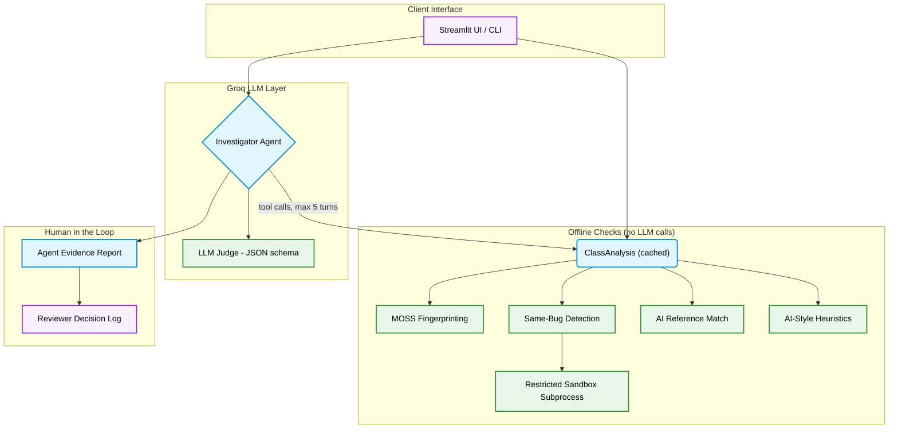

<div align="center">

# CodeSentinel

**An evidence-based integrity triage system for coding assessments, powered by MOSS-style fingerprinting, a Groq LLM investigator and Streamlit.**

[](https://www.python.org/)
[](https://streamlit.io/)
[](https://groq.com/)
[](https://pandas.pydata.org/)
[](https://docs.pytest.org/)

</div>

---

## Overview

CodeSentinel helps assessment teams decide **whom to ask a follow-up question**, never who is guilty. It gathers independent pieces of evidence for every submission: classmate copying, identical wrong outputs, overlap with AI-generated solutions and AI-style signals. A tool-using LLM agent then weighs that evidence and drafts an evidence report, and a human reviewer makes the final call. Every decision is stored in an audit log.

> **System flags, human decides.**

---

## Architecture Overview



---

## Features

| Component                     | Description                                                                                                                                       |
| ----------------------------- | ------------------------------------------------------------------------------------------------------------------------------------------------- |
| **MOSS-Style Fingerprinting** | Tokenises code, normalises names, strings and numbers, then applies k-grams and winnowing (Schleimer et al., SIGMOD 2003) to detect copied structure. |
| **Same-Bug Detection**        | Runs hidden tests and groups candidates that fail the same tests with *identical wrong outputs*, a rarely coincidental signal.                    |
| **AI Reference Match**        | Generates solutions from several AI models and compares each submission against them, without the common-code filter.                             |
| **AI-Style Analysis**         | Explainable heuristics (naming, docstrings, type hints, comments) plus an optional LLM-as-judge returning strict JSON via Groq structured outputs. |
| **Investigator Agent**        | A Groq LLM chooses which checks to run (up to 5 turns), cites real lines of code and drafts follow-up questions. It never declares guilt.         |
| **Human Review Log**          | Reviewers clear, schedule a follow-up interview or escalate; each decision is saved with the agent report that informed it.                       |
| **Evaluation Harness**        | Measures precision, recall and false-positive rate on a labelled dataset of AI, tidy-human and messy-human code.                                  |

---

## Technology Stack

| Component            | Technologies                                           |
| :------------------- | :----------------------------------------------------- |
| **LLM Inference**    | `Groq` (default model: `openai/gpt-oss-120b`)          |
| **Frontend UI**      | `Streamlit`, `Pandas`                                  |
| **Detection Core**   | Custom lexer, k-gram hashing and winnowing (pure Python) |
| **Code Execution**   | Restricted `subprocess` sandbox (timeouts, memory limits, scrubbed env) |
| **Configuration**    | `python-dotenv`, Streamlit secrets                     |
| **Testing**          | `Pytest`, Streamlit `AppTest`                          |
| **Quality & CI**     | `Ruff`, GitHub Actions                                 |
| **Optional Extra**   | `fastembed` code embeddings (`jina-embeddings-v2-base-code`) |

---

## Project Structure

```text
CodeSentinel/
├── app.py                      # Streamlit application
├── codesentinel/
│   ├── __init__.py             # App name and version
│   ├── __main__.py             # python -m codesentinel entry point
│   ├── agent.py                # Tool-using investigator agent
│   ├── ai_style.py             # Heuristic + LLM-judge style analysis
│   ├── analysis.py             # Cached class-wide analysis
│   ├── cli.py                  # Command-line interface
│   ├── config.py               # Paths, models, thresholds
│   ├── embeddings.py           # Optional embedding similarity
│   ├── evaluation.py           # Precision / recall / FPR harness
│   ├── llm.py                  # Groq client + token accounting
│   ├── moss.py                 # k-grams, winnowing, pair comparison
│   ├── problems.py             # Problem loader
│   ├── reference.py            # AI reference generation and matching
│   ├── reviews.py              # Human decision log
│   ├── sandbox.py              # Restricted runner for untrusted code
│   ├── same_bug.py             # Identical-wrong-output grouping
│   └── tokenizer.py            # Lexer and normalisation
├── data/
│   ├── problems/               # problem.md, starter.py, tests.json, submissions/, references/
│   ├── evals/                  # Labelled dataset + cached LLM judgements
│   └── samples/                # Demo samples
├── tests/
│   ├── conftest.py
│   ├── test_core.py            # Tokenizer, MOSS, sandbox, analysis
│   ├── test_agent_and_reviews.py   # Agent with a scripted LLM, review log
│   └── test_app.py             # Streamlit AppTest scenarios
├── .devcontainer/
│   └── devcontainer.json       # GitHub Codespaces / VS Code dev container
├── .github/workflows/ci.yml    # Lint + tests on push
├── .streamlit/                 # config.toml, secrets.toml.example
├── .dockerignore
├── .env.example                # Groq API key template
├── .gitignore
├── Dockerfile                  # Container image (runs as non-root)
├── LICENSE                     # MIT
├── pyproject.toml              # Project metadata and tooling
└── requirements.txt            # Runtime dependencies
```

---

## Setup & Execution

### 1. Environment Initialization

```bash
git clone <your-repo-url>
cd CodeSentinel
python -m venv .venv
source .venv/bin/activate        # Windows: .venv\Scripts\activate
pip install -r requirements.txt
```

### 2. Configure Environment Variables

Create a `.env` file in the root directory and add your Groq API key (free keys at [console.groq.com/keys](https://console.groq.com/keys)):

```env
GROQ_API_KEY=your_api_key_here
```

You can also paste the key into the app sidebar; it is kept in the browser session only. Offline checks work without a key.

### 3. Run the Streamlit App

```bash
streamlit run app.py
```

### 4. Use the Command Line

```bash
python -m codesentinel scan longest_substring                    # offline class scan
python -m codesentinel moss longest_substring --show alice bob   # side-by-side matched lines
python -m codesentinel same-bug longest_substring
python -m codesentinel ai-style longest_substring --llm
python -m codesentinel agent longest_substring divya             # needs GROQ_API_KEY
python -m codesentinel evals -v                                  # add --llm to score cache misses
python -m codesentinel reference generate max_subarray           # regenerate AI references
```

### 5. Run Tests

```bash
pip install -e ".[dev]"
ruff check .
pytest -q
```

---

## Configuration

| Variable                    | Default                 | Purpose                                         |
| --------------------------- | ----------------------- | ----------------------------------------------- |
| `GROQ_API_KEY`              | none                    | Groq API key (env, `.env` or Streamlit secrets) |
| `CODESENTINEL_MODEL`        | `openai/gpt-oss-120b`   | Default Groq model                              |
| `CODESENTINEL_DATA_DIR`     | `./data`                | Problems and datasets                           |
| `CODESENTINEL_REVIEWS_PATH` | `./data/reviews.json`   | Decision log location                           |

Detection thresholds live in `codesentinel/config.py`. To add a problem, create `data/problems/<id>/` with `problem.md`, `starter.py`, an optional `tests.json` and `submissions/*.py`.

---

## Deployment

### 1. Push to GitHub

```bash
git init
git add .
git commit -m "Initial commit: CodeSentinel"
git branch -M main
git remote add origin https://github.com/<your-username>/CodeSentinel.git
git push -u origin main
```

`.env` and `.streamlit/secrets.toml` are git-ignored, so your API key is never pushed. Check with `git status` before committing.

### 2. Deploy on Streamlit Community Cloud

1. Open [share.streamlit.io](https://share.streamlit.io) and choose **Create app** → **From existing repo**.
2. Select your repository, branch `main` and main file path `app.py`.
3. Open **Advanced settings**, choose Python **3.12** and paste your key under **Secrets**:

```toml
GROQ_API_KEY = "your_api_key_here"
```

4. Click **Deploy**. Dependencies install from `requirements.txt` automatically.

- **Dashboard URL:** `https://<your-app-name>.streamlit.app/` *(add yours after deploying)*

> The decision log (`data/reviews.json`) lives on the app's file system, which is ephemeral on hosted platforms. Use the in-app **Download** button or point `CODESENTINEL_REVIEWS_PATH` at persistent storage.
>
> The **Analyse a submission** tab can execute pasted code on the host (restricted subprocess, not a hardened sandbox). Keep that in mind before sharing a public URL, or deploy the Docker image below instead.

### Alternative: Docker

```bash
docker build -t codesentinel .
docker run --rm -p 8501:8501 -e GROQ_API_KEY=your_api_key_here codesentinel
```

### Alternative: GitHub Codespaces

Open the repository in a Codespace; `.devcontainer/devcontainer.json` installs the dependencies and starts the app on port 8501.

---

## Evaluation Results

Measured on the bundled dataset (30 samples: 12 AI, 9 tidy human, 9 messy human):

| Detector            | Precision | Recall | False-Positive Rate |
| ------------------- | --------- | ------ | ------------------- |
| Heuristic           | 69%       | 75%    | 22%                 |
| AI reference match  | 50%       | 50%    | 33%                 |
| LLM judge           | 86%       | 50%    | 6%                  |
| Combined (2+ agree) | 75%       | 50%    | 11%                 |

These numbers are modest on purpose: AI-code detection is hard, tidy human code gets flagged and small datasets are noisy. Treat every flag as a reason to ask a question, and re-run `python -m codesentinel evals -v` on your own samples before trusting a threshold.

---

## Security Notes

- Hidden tests execute submitted code in a restricted subprocess (isolated interpreter, timeout, memory limit, scrubbed environment so API keys are not inherited). This is defence in depth, **not** a hardened sandbox: run the app in a container or VM when handling untrusted code.
- Candidate code is passed to the LLM as untrusted data, and the prompts instruct the model to ignore instructions inside it.
- API keys are never written to disk by the app.

---

## Deep Codebase Analysis

| File                                  | Purpose / Details                                                                                                  |
| ------------------------------------- | ------------------------------------------------------------------------------------------------------------------ |
| `app.py`                              | Streamlit UI with six tabs: class scan, pair comparison, AI investigator, submission analyser, evaluation, about.   |
| `codesentinel/agent.py`               | Investigator loop: one LLM, four tools, at most five turns; returns the report, risk level and tool trace.         |
| `codesentinel/ai_style.py`            | Heuristic AI-style scoring and the LLM judge with a strict JSON schema.                                            |
| `codesentinel/analysis.py`            | `ClassAnalysis`: computes MOSS pairs and test signatures once and shares them across UI, CLI and agent.            |
| `codesentinel/cli.py`                 | `python -m codesentinel` subcommands: scan, moss, same-bug, reference, ai-style, agent, evals, embeddings.         |
| `codesentinel/config.py`              | Paths, model names, detection thresholds and sandbox limits, overridable through environment variables.            |
| `codesentinel/embeddings.py`          | Optional embedding-based similarity for logic-level matches (needs the `embeddings` extra).                        |
| `codesentinel/evaluation.py`          | Loads the labelled dataset, scores every detector and computes precision, recall and false-positive rate.          |
| `codesentinel/llm.py`                 | Per-session Groq client wrapper with call and token accounting.                                                    |
| `codesentinel/moss.py`                | k-gram hashing, winnowing, fingerprint comparison and common-code filtering.                                       |
| `codesentinel/problems.py`            | `Problem` dataclass and loader for statements, starters, tests, submissions and references.                        |
| `codesentinel/reference.py`           | Generates AI reference solutions and matches submissions against them.                                             |
| `codesentinel/reviews.py`             | Atomic JSON decision log for the human review step.                                                                |
| `codesentinel/sandbox.py`             | Runs untrusted code with timeout, memory and file-size limits and a scrubbed environment.                          |
| `codesentinel/same_bug.py`            | Runs hidden tests in parallel and groups candidates with identical wrong outputs.                                  |
| `codesentinel/tokenizer.py`           | DFA-style lexer that normalises identifiers, numbers and strings.                                                  |
| `tests/test_core.py`                  | Unit tests for tokenizer, winnowing, heuristics, sandbox limits and class analysis.                                |
| `tests/test_agent_and_reviews.py`     | Agent loop tested with a scripted fake LLM; review log round-trips.                                                |
| `tests/test_app.py`                   | Headless Streamlit `AppTest` scenarios, including the agent and review flow.                                       |
| `.github/workflows/ci.yml`            | Runs Ruff and Pytest on Python 3.10 and 3.12.                                                                      |
| `.devcontainer/devcontainer.json`     | Dev container for Codespaces / VS Code: Python 3.12, installs dependencies, forwards port 8501.                    |
| `Dockerfile` / `.dockerignore`        | Slim Python image that runs Streamlit as a non-root user, with a health check.                                     |
| `.streamlit/config.toml`              | Headless server, usage stats off, theme colour.                                                                    |
| `.streamlit/secrets.toml.example`     | Template for `GROQ_API_KEY` (copy to `secrets.toml` locally; never commit the real file).                          |
| `.env.example`                        | Environment-variable template for local runs.                                                                      |
| `requirements.txt` / `pyproject.toml` | Runtime dependencies for Streamlit Cloud; project metadata, extras and Ruff/Pytest config.                         |
| `LICENSE`                             | MIT license.                                                                                                       |
